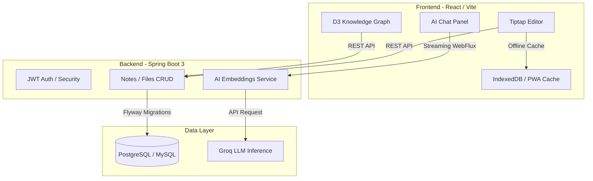

<div align="center">
  

  <h1 align="center">Knowledge Hub</h1>
  <p align="center">
    <strong>Your AI-powered second brain and private knowledge base.</strong>
  </p>

  <p align="center">
    <a href="https://knowledge-hub-mocha.vercel.app" target="_blank">
      
    </a>
    
    
    
  </p>

  <p align="center">
    <a href="#features">Features</a> •
    <a href="#the-viral-loop-public-sharing">Public Sharing</a> •
    <a href="#architecture">Architecture</a> •
    <a href="#getting-started">Getting Started</a> •
    <a href="#api-reference">API</a>
  </p>
</div>

---

Knowledge Hub is a secure, privacy-first personal knowledge management system that blends Notion-style note-taking with a built-in AI assistant. It allows you to organize your thoughts, automatically tag them using AI, visualize connections in a knowledge graph, and share your best ideas with the world through public, read-only links.

## ✨ Features

### 🧠 The AI Second Brain
Knowledge Hub doesn't just store your notes; it understands them. Powered by Groq (LLaMA 3.3 70B), the built-in AI acts as a research assistant that can answer questions based **strictly on your private notes**, complete with source citations. 

### 🔗 The Viral Loop: Public Sharing
Want to share an idea with Twitter, Reddit, or your team? Click the "Share" button to generate a beautiful, public, read-only link (e.g. `your-app.com/shared/a3bF9k2x`). Anyone with the link can view your note seamlessly without logging in, and the built-in "Made with Knowledge Hub" footer drives organic traffic right back to your platform.

### 📝 Notion-Grade Editor
A highly polished, Tiptap-based rich text editor featuring:
* Slash commands (`/`) for rapid formatting.
* Floating context menus and bubble menus.
* Full markdown shortcut support.
* Syntax-highlighted code blocks and task lists.

### 🕸️ Interactive Knowledge Graph
See how your thoughts connect. Notes and tags are visualized in a stunning, interactive force-directed graph built with D3, allowing you to discover hidden relationships in your data.

### ⚡ Lightning Fast & Offline Ready
Knowledge Hub is a Progressive Web App (PWA). It uses IndexedDB (Dexie) and Service Workers to cache your notes locally, ensuring the app loads instantly and your notes remain accessible even when you drop off the grid.

### ⌨️ Developer-First UX
* **Quick Capture:** Hit `Ctrl+Shift+K` to instantly dump a thought from anywhere in the app.
* **Command Palette:** Hit `Ctrl+K` to instantly search and jump to any note, tag, or setting.
* **Zen Mode:** A fullscreen, distraction-free writing environment with smooth animated transitions.

---

## 🛠️ Tech Stack

**Frontend:** React 18, Vite, Tailwind CSS, Tiptap, Framer Motion, React Force Graph 2D, Dexie.js (IndexedDB).  
**Backend:** Java 17, Spring Boot 3.2, Spring Security (JWT), Spring Data JPA, WebFlux.  
**Database:** PostgreSQL (Neon) or MySQL 8, managed by Flyway Migrations.  
**AI Inference:** Groq API (LLaMA 3.3 70B)  

---

## 🏗️ Architecture



---

## 🚀 Getting Started

### Prerequisites
* Java 17+
* Node.js 18+
* PostgreSQL or MySQL Database
* A free [Groq API Key](https://console.groq.com/)

### 1. Clone & Configure
```bash
git clone https://github.com/Fantcoder/Knowledge-hub-.git
cd Knowledge-hub-
```

### 2. Backend Setup
```bash
cd backend
cp .env.example .env
```
Populate the `.env` file with your database credentials, a secure `JWT_SECRET`, and your `GROQ_API_KEY`.
```bash
mvn spring-boot:run
# Backend starts on http://localhost:8080
```

### 3. Frontend Setup
```bash
cd frontend
npm install
npm run dev
# Frontend starts on http://localhost:5173
```

---

## 🌍 Deployment

Knowledge Hub is designed to be easily deployed to modern cloud platforms:

1. **Frontend:** Optimized for Vercel. Simply connect the repository and build using `npm run build`.
2. **Backend:** Optimized for Render or Heroku using the included `Dockerfile` or native Java environments.
3. **Database:** Designed for Neon (Serverless Postgres) or Railway.

*See `backend/src/main/resources/application-prod.properties` for production configuration overrides.*

---

## 🛡️ License

This project is open-source and free to use. Contributions, issues, and feature requests are welcome!

<div align="center">
  <p>Built with ☕ and curiosity.</p>
</div>
